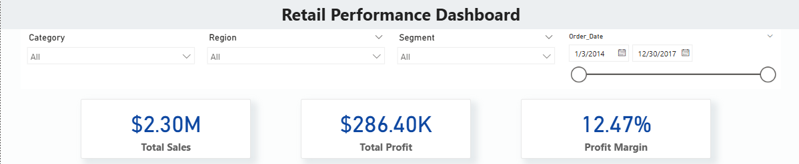

# Retail Performance Dashboard

This project showcases a professional Power BI dashboard analyzing retail sales, profit, and key business KPIs using the Superstore dataset.

## Dashboard Features
- KPI Cards: Total Sales, Profit, Profit Margin
- Monthly Sales Trend (Line Chart)
- Top 5 Products by Sales (Bar Chart)
- Sales by Category (Donut Chart)
- Profit by Region (Clustered Bar Chart)
- Interactive Slicers: Category, Region, Segment, Date

## Tools Used
- Power BI Desktop
- DAX (Calculated Columns & Measures)
- Power Query Editor (Data Cleaning & Transformation)
- Superstore Dataset (Kaggle)

## Project Files
- Retail_Performance_Dashboard.pbix (Power BI Project File)
- Retail_Performance_Dashboard.pdf (Static PDF Export)
- Dashboard Screenshots

## Dashboard Previews
### Full Dashboard Overview

### KPI Cards and Slicers

### Monthly Sales Trend and Top Products

### Sales by Category and Profit by Region

## About the Dataset
The Superstore Sales Dataset is a publicly available dataset from Kaggle, commonly used for data visualization and dashboard projects.
